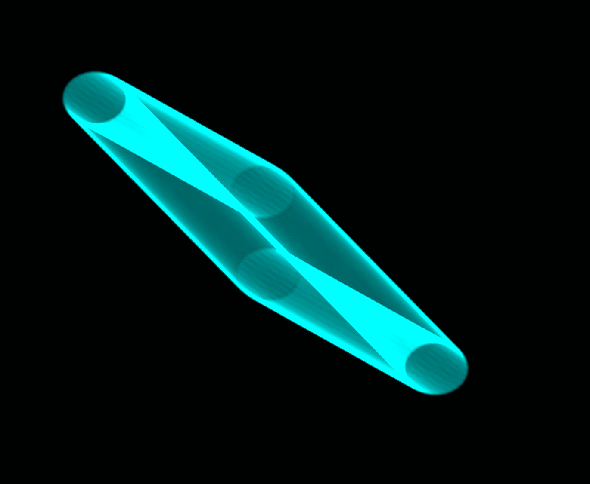

# semiconductor

a norns ensemble script

this script was written to support the creation of physically gathered together norns ensembles, providing players a way of "conducting" a performance in a non-hierarchical manner.

it occurred to me that a whole lot of music performance involves control. also, and conversely, there has been a lot of music concerned more with giving up control to a machine with the development of generative music and instruments inspired by chaos (blippoo box and wing pinger, for example). this script is meant to promote a somewhat different approach, where a performance is built around performers in immediate physical proximity to one another giving up control to each other as a performative strategy.

## requirements

* norns 

## install

`https://github.com/jaseknighter/semiconductor`

## how does it work?
using this mod, players gather together and connect their norns to the same network.

then, each of the norns registers itself with one norns that has been selected to act as a "host." the host norns then broadcasts each registration with all the other devices.

once registered, each norns can see what scripts the other norns have currently loaded and select parameters from one or more registered script to (semi)conduct. the remote parameters that appear in this mod may be controlled (more or less) just as if the script was running on the norns locally.

the mod also includes macro param features that allow multiple params on multiple norns to be mapped and controlled from a single macro param. 

## instructions

### get started

* assemble your ensemble and connect each norns to the network (wifi or physical)
* turn on the `semiconductor` mod on each of the norns and restart
* chose one norns to be the *host* and note the host's ip address (e.g. on a piece of paper)
* in the `PARAMETERS>EDIT` menu of the *host* norns, set the `host enabled` parameter to `true` 
  * IMPORTANT NOTE: only one norns in the ensemble should have this setting set to `true`
* enter the `semiconductor` mod menu
* enter the `REGISTER >` menu, select `register`, provide a name for your norns and then when prompted enter the ip address of the host (note: see *shortcuts* below)
* enter the `PLAYERS >` menu and select a script to conduct 

### leave the ensemble
* enter the `semiconductor` mod menu
* enter the `REGISTER >` menu and select `unregister`

### group sync
there are three params that you can sync across all registered norns from the `group sync >` sub-menu found in `PARAMETERS>EDIT`:

* `output levels`: change all the norns output levels 
* `tempos`: change all the norns tempos
* `clocks reset`: reset all the norns clocks to sync them with one another 

### macros
macros allow you to change multiple paramaters at once, either within a single script or across multiple scripts.

* enter the mod's `PMAP` menu, select a registered norns, and set one or more of the listed params to one of the macro controls. 
* repeat the step above for a different registered norns to set params for multiple norns simultaneously.
* by default, there are 10 macro controls that params can be mapped to. the variable `max_pmaps` defined in the */lib/globals.lua* file can be updated to generate more or less macro controls

#### changing the macro controls directly
* the macro controls are found in the main script parameters menu (PARAMETERS>EDIT) at the bottom of the list of params (i.e. following whatever params the main script loads by default into the PARAMETERS>EDIT menu)
* since these macro controls are params, they can be midi mapped (e.g. to a 16n controller)

#### xy controller
you can change the macro controls directly from the mod menu: 

* map two or more params to a couple of macros (see *macros* above)
* select `xy` from the mod's `MACROS` menu and a dot will appear that can be moved with E2 and E3. as the dot moves, two of the macro controls will be updated.
* you can change which macro controls are updated with the `xy controller` from the PARAMETERS>EDIT menu by updating the `macro x` and `macro y` parameters to map to one of the 10 `macro controls`
* by default, macro controls 1 and 2 are mapped to x and y, respectively

## misc notes
### controlling complex scripts 
some scripts (e.g. cheat codes and flora) have custom state handling features that will not be accessible from the `semiconductor` mod or, if accessible, may result in errors. *proceed with caution.*

### running a new script after registering
after registering your norns with the `semiconductor` mod, if you change the script you are running locally, all the other registered norns will be notified of the change and any norns that had your script selected will have to select a new script in the `PLAYERS >` menu.

### shortcuts to speed up registration
* for each norns in the ensemble, in the file */lib/globals.lua*, set the parameter `norns_name` to a unique name.
* for each norns in the ensemble, in the file */lib/globals.lua* set the parameter `host_ip` to the name of the one norns that will act as the host for the ensemble.

## using this mod with a single norns
this mod will work with just a single norns (e.g. to take advantage of the macro controls)

## todo
* fix bugs
  * some types of params (e.g. fileselect and trigger) may not work properly
  * other issues not yet uncovered
* add more control interfaces (e.g. a lorenz param controller)

